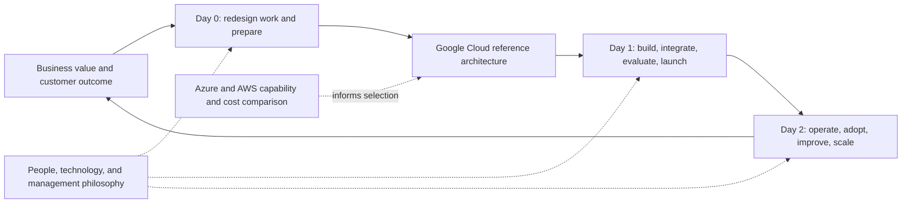

# Enterprise AI on Google Cloud: From Business Value to Production

**Google Cloud is the primary architecture and implementation path, supported by equivalent-layer Microsoft Azure and AWS comparisons, pricing analysis, and Day 0–2 adoption guidance.**

**[Start with Google Cloud](docs/gcp-enterprise-architecture.md)** · [Compare Azure and AWS](docs/cross-cloud-comparison.md) · [Compare workload costs](docs/pricing-and-economics.md)

Enterprise AI succeeds when a better business process becomes a dependable service that people use. Models contribute language, reasoning, coding, and multimodal capabilities. Enterprise architecture combines those capabilities with data, applications, workflow, user experience, engineering, economics, and an operating team.

This guide connects the decisions a director and architect must make: **where AI creates value, how work should change, which capabilities to buy or build, how to deliver them, and how to sustain the result.** Governance supports that journey through clear responsibilities and well-designed business controls.

Follow a fictional service-recovery process through the Google Cloud architecture: model and data choices, agent development, MCP integration, deployment, and sustained operation. Use the Azure and AWS comparison to test the same requirements and economic assumptions against alternative platforms. The Google Cloud focus sets the reading path; platform selection remains an evidence-based business decision.

**Day 0, Day 1, and Day 2 are lifecycle stages, not three calendar days.** The [adoption roadmap](docs/adoption-roadmap.md) translates them into an illustrative delivery sequence.

## Follow the Google Cloud journey end to end

Begin with the [Google Cloud deep dive](docs/gcp-enterprise-architecture.md) for the complete architecture walkthrough. The chapters below develop the business, delivery, and operating decisions behind that design and provide the comparison needed to evaluate it.

| Chapter | Question it answers |
|---|---|
| 1. [Executive brief](docs/executive-brief.md) | What should leadership invest in, and how will value be demonstrated? |
| 2. [Value and enterprise AI capabilities](docs/value-and-capabilities.md) | Where do LLMs, retrieval, multimodality, workflows, and agents help? |
| 3. [Day 0: business process redesign](docs/day-0-business-process.md) | What must change before adopting the technology? |
| 4. [End-to-end enterprise architecture](docs/reference-architecture.md) | How do business, data, application, AI, infrastructure, and operations fit together? |
| 5. [Google Cloud deep dive](docs/gcp-enterprise-architecture.md) | How do the selected services form the primary implementation path? |
| 6. [Google Cloud, Azure, and AWS comparison](docs/cross-cloud-comparison.md) | What are the equivalent layers, differences, and trade-offs? |
| 7. [Pricing and service economics](docs/pricing-and-economics.md) | What do comparable workloads cost, and what does a token price omit? |
| 8. [Day 1: build and launch](docs/day-1-build-and-launch.md) | How should the team deliver an integrated service? |
| 9. [Day 2: operate and improve](docs/day-2-operate-and-improve.md) | How do reliability, adoption, quality, cost, and expansion work after launch? |
| 10. [People and operating model](docs/operating-model.md) | Who owns the outcome, and how does the team learn and scale? |
| 11. [Governance within business realignment](docs/governance-and-business-realignment.md) | How do people, technology, and management philosophy shape responsible delegation? |

For a leadership review, pair the Google Cloud chapter with chapters 1, 3, 7, and 10. For implementation planning, use chapters 4, 5, 8, and 9. For a platform decision, use chapter 6, the shared pricing model, and the [platform decision framework](docs/platform-decision-framework.md).

## The running business example

A fictional enterprise wants to resolve delivery disruptions faster. Today, a specialist gathers information from several systems, interprets the issue, arranges a remedy, and explains the outcome. The proposed service uses AI for interpretation and synthesis, applications for authoritative records, and explicit workflow for commitments and exceptions.

Follow the [three-tool walkthrough](docs/from-prompt-to-enterprise-service.md) from order status and loyalty lookup to a proposed remedy, authorized execution, and verified outcome. It makes rules, skills, tool contracts, and systems of record concrete before mapping them to cloud services.

The [use-case portfolio](docs/use-case-portfolio.md) extends the pattern to IT operations, software engineering, financial services, healthcare and pharmaceutical operations, manufacturing, and assurance. Each proposed use case connects a business problem with process changes, capability requirements, boundaries, and outcome measures.

## Reusable artifacts

| Artifact | Purpose |
|---|---|
| [Process redesign canvas](templates/process-redesign-canvas.md) | Current and future process, people changes, benefit hypothesis |
| [Use-case intake](templates/use-case-intake.md) | Decide whether and where to use AI |
| [Platform evaluation](templates/platform-evaluation.md) | Compare candidates using common requirements and evidence |
| [Capability registration](templates/capability-registration.md) | Define supported integration contracts and ownership |
| [Release review](templates/release-review.md) | Business, user, technical, and operational launch readiness |
| [Value scorecard](templates/value-scorecard.md) | Adoption, outcomes, capacity, economics, exceptions |
| [Cost model](examples/cost-model/README.md) | Reproduce pricing scenarios and inspect assumptions |
| [Policy simulator](examples/service-recovery/README.md) | Inspect a decision boundary using fictional data |

Technical supplements: [MCP foundations](docs/mcp-foundations.md), [security and assurance](docs/security-and-assurance.md), and an [architecture decision on transaction authority](decisions/001-enforce-authority-at-execution.md).

## Evidence and scope

**Edition 0.3.1 · product and pricing research reviewed 9 October 2026.** Product and pricing claims link to public primary sources. The [research index](research/README.md) separates documented capabilities, proposed designs, sourced prices, and illustrative assumptions. The [topic coverage map](research/topic-coverage.md) connects the practical MCP learning journey with the full enterprise architecture. Region, commercial availability, feature status, quotas, and deployment mode require implementation-specific verification.

This is an architecture and research guide with local illustrative code. It reports no deployed hyperscaler solution, measured cloud benchmark, or achieved business return. All business examples are fictional; no employer, client, private architecture, customer records, or confidential commercial terms are included.

The protocol supplement discusses MCP 2026-07-28; this does not imply every cloud product or SDK implements that revision. No repository license has been selected. See [contribution guidance](CONTRIBUTING.md), [security reporting](SECURITY.md), and [change log](CHANGELOG.md).
