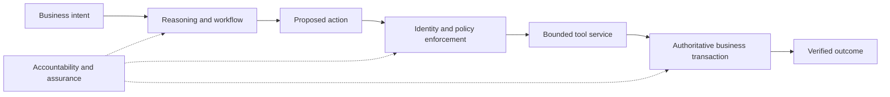

# Enterprise Agent Governance Guide

## From Prompting to Governed Agency

**A provider-neutral field guide for directors, enterprise architects, and platform leaders.**

The enterprise value of an agent lies in completing an authorized business outcome. A capable model is one component; dependable service also requires bounded tools, verified identity, explicit policy, transaction integrity, evaluation, and accountable ownership.

This guide explains how to organize that system, where the Model Context Protocol (MCP) helps, and what the protocol leaves to the enterprise. It combines primary-source research with a proposed reference architecture, an operating model, reusable decision templates, and a small executable policy example.

**The investment question:** which capabilities should an organization make available to agents, under what authority, and with what evidence that the resulting service is useful and controlled?



MCP standardizes an integration boundary. It does not, by itself, establish business authority or guarantee a safe transaction. The protocol includes authorization and security provisions; enterprises must implement them and add their own domain controls. [MCP specification](https://modelcontextprotocol.io/specification/2026-07-28), [authorization specification](https://modelcontextprotocol.io/specification/2026-07-28/basic/authorization)

## Choose a reading path

| Reader | Start here | Decision or artifact |
|---|---|---|
| Director or investment sponsor | [Executive brief](docs/executive-brief.md) | Whether to fund a bounded service and reusable foundations |
| Enterprise or solution architect | [MCP foundations](docs/mcp-foundations.md), then [reference architecture](docs/reference-architecture.md) | Trust boundaries, enforcement locations, integration contracts |
| Security and risk leader | [Security and assurance](docs/security-and-assurance.md), then [operating model](docs/operating-model.md) | Threat controls, accountable owners, release evidence |
| Platform or procurement lead | [Platform decision framework](docs/platform-decision-framework.md) | Evidence-based selection without provider rankings |
| Delivery lead | [90-day adoption plan](docs/adoption-roadmap.md), then [templates](templates/README.md) | A staged, measurable implementation plan |
| Engineer or technical reviewer | [Synthetic service-recovery example](examples/service-recovery/README.md) | Inspectable policy decisions and adversarial tests |
| Research reader | [Research method and evidence map](research/README.md) | Sources, versions, limitations, and open questions |

## Five positions this guide takes

1. **Business outcomes determine the architecture.** Use an agent where interpreting varied intent or evidence adds value. Prefer a conventional workflow when the process is stable and fully specified.
2. **Authority belongs outside the model.** Tool discovery, instructions, and a persuasive explanation are insufficient grounds for a business transaction.
3. **Reuse needs ownership.** Shared tools and procedures create value only when their compatibility, control costs, and support obligations are managed.
4. **Portability requires evidence.** A common protocol helps integration; equivalent identity, behavior, operations, and economics still need testing.
5. **Autonomy is earned through bounded evidence.** Start with narrow scope and an exception path, then expand only when outcome and control measures justify it.

These are the guide's design positions, not claims of certification or measured industry results.

## Inspect the example

The example uses fictional records and non-monetary demo credits. It is a **policy decision simulator**, with no model calls, network access, credentials, real transactions, or MCP transport implementation.

With Python 3.9 or later, run from the repository root:

```console
python examples/service-recovery/evaluator.py
python -m unittest discover -s examples/service-recovery -p "test_*.py" -v
python tools/verify_repository.py
```

Passing the example tests demonstrates only the documented local policy behavior. It does not validate a deployed identity system, approval service, transaction ledger, or agent platform.

## Repository map

```text
docs/                       Executive, architecture, security, and operating guidance
decisions/                  Architecture decision records
templates/                  Intake, tool registration, release, and platform reviews
examples/service-recovery/  Synthetic contracts, decisions, trace, and tests
research/                   Primary-source registers and evidence boundaries
tools/                      Local repository checks
```

## Research and publication status

- **Edition:** 0.1, reviewed 9 October 2026.
- **MCP baseline:** 2026-07-28. Earlier implementations may use different lifecycle and transport behavior; verify compatibility before applying examples from any revision.
- **Scope:** public standards, original architectural analysis, and fictional examples. No organization-specific architectures, provider product comparisons, customer records, or internal research artifacts are included.
- **Evidence boundary:** this is a research and design guide. It reports no production deployment, comparative benchmark, demonstrated return on investment, or regulatory approval.
- **License:** no repository license has been selected for this edition.

See [contribution guidance](CONTRIBUTING.md), [security reporting](SECURITY.md), and the [change log](CHANGELOG.md).
