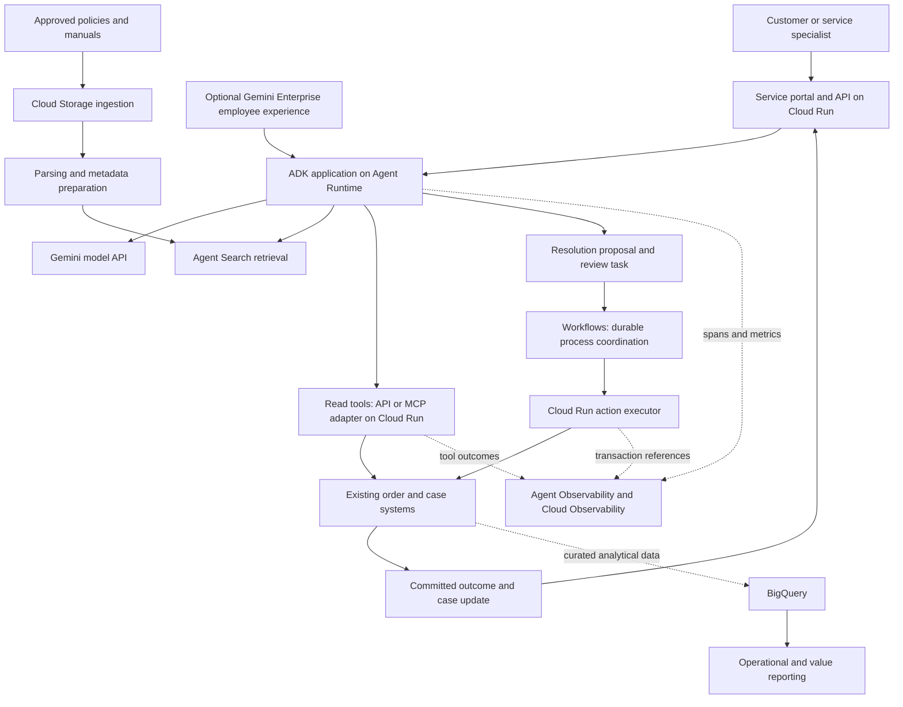
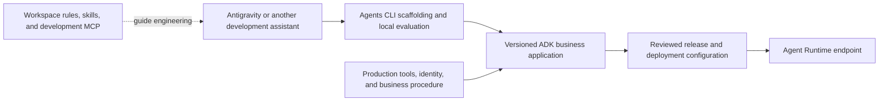

# Google Cloud: from an enterprise process to an operating AI service

**Research reviewed: 2026-10-09 UTC.** This is a proposed architecture, supported by public Google documentation, not a deployed reference implementation or a claim of business results. Product names reflect the April 22, 2026 naming transition; the current Runtime documentation was updated October 7, 2026. [Release notes](https://docs.cloud.google.com/gemini-enterprise-agent-platform/release-notes), [Agent Runtime](https://docs.cloud.google.com/gemini-enterprise-agent-platform/build/runtime)

## Start with the work that should improve

Consider a fictional distributor handling delayed deliveries. Today, a service specialist reads a customer message, checks an order application, finds the applicable policy, interprets an attached delivery document, requests an exception when necessary, updates the case, and explains the outcome. The delay often comes from fragmented evidence and handoffs.

The proposed service assembles evidence, identifies missing information, prepares a resolution, and completes permitted actions through existing business APIs. Its success measure is **time and cost per verified resolution**, accompanied by customer recontact, incorrect-action, and exception rates. Faster drafting alone is an intermediate benefit.

Keep the existing process as the baseline. If every delayed order has one known response and the required fields already exist, a conventional event-driven workflow may solve the problem more cheaply and predictably. Add model reasoning where messages are ambiguous, evidence spans formats, or the next investigative step varies. This allocation of work is the guide's design recommendation, not a product requirement.

## Understand the current product boundaries

Google's April 22, 2026 release notes place Vertex AI within **Gemini Enterprise Agent Platform** and rename Agent Engine to **Agent Runtime**, Vertex AI Search to **Agent Search**, and Vertex AI RAG Engine to **RAG Engine**. Existing API paths and examples can retain earlier identifiers. [Naming changes](https://docs.cloud.google.com/gemini-enterprise-agent-platform/release-notes)

| Capability | Relevant Google component | Architectural responsibility |
| --- | --- | --- |
| Model inference | Gemini APIs; model choices in Model Garden | Interpret, extract, reason, and generate; select a specific model against workload evidence |
| Visual development | Agent Studio | Explore prompts and agent behavior; a development surface rather than the business transaction system |
| Agent implementation | Agent Development Kit, or ADK | Define agent logic, tools, context, and orchestration in code |
| Development lifecycle | Agents CLI | Assist scaffolding, local execution, evaluation, and deployment |
| Managed hosting | Agent Runtime | Operate the deployed agent application and its runtime resources |
| Conversation continuity | Sessions; optional Memory Bank | Maintain conversation context and, when justified, information across conversations |
| Employee distribution | Gemini Enterprise web app | Make registered custom agents available to employees; a separate experience and administration choice |

Google documents low-code, managed-code, and ADK development paths. This chapter selects ADK for explicit control of the service-recovery application; it does not imply ADK is mandatory for every workload. [Platform agents overview](https://docs.cloud.google.com/gemini-enterprise-agent-platform/agents), [Gemini Enterprise agent types](https://docs.cloud.google.com/gemini/enterprise/docs/agents-overview)

Agent Runtime is managed hosting, while ADK is a framework. The current SDK migration guidance moves `vertexai.agent_engines` to `agentplatform.Client().runtimes` in the standalone `google-cloud-agentplatform` package. Deployment resource names can still contain `reasoningEngines`. Select a consistent SDK and API generation instead of combining snippets across naming eras. [Runtime SDK migration context](https://docs.cloud.google.com/gemini-enterprise-agent-platform/build/runtime), [deployment reference](https://docs.cloud.google.com/gemini-enterprise-agent-platform/scale/runtime/deploy-an-agent)

## A proposed architecture for service recovery

The diagram separates investigation from committing a business change. The existing order application remains authoritative. The approval task and action executor are application components that the delivery team must implement or integrate.

**Proposed execution:** the agent clarifies the request, retrieves current order facts, finds the relevant policy passage, and interprets any attachment. It creates a structured proposal with evidence references. A deterministic service evaluates eligibility and limits. An exception becomes a review task; an eligible resolution enters the execution workflow. The executor rechecks state and commits through the order system. Only a confirmed outcome is described as completed to the user.

| Component choice | Needed for this design? | Reason |
| --- | --- | --- |
| Model plus application runtime | Yes | Support variable interpretation and an available application endpoint |
| Business APIs and transaction executor | Yes | Read current facts and commit permitted changes |
| Agent Search | Only if policy/document retrieval is needed | Avoid loading an entire document collection into each request |
| RAG Engine or custom vector retrieval | Alternative | Choose when retrieval customization warrants it; do not add every retrieval product |
| Workflows | Conditional | Useful for durable waits and coordination; a short synchronous operation may not need it |
| BigQuery | Optional | Analyze cohorts, recurring causes, and economics; unnecessary for a single order lookup |
| Memory Bank, multi-agent delegation, Gemini Enterprise | Optional | Add only for measured continuity, specialization, or distribution needs |

Cloud Run officially supports remote MCP hosting with Streamable HTTP. Workflows provides service orchestration with state, retries, polling, and long waits. Their combination here is a proposed integration, not a bundled service-recovery product. [Cloud Run MCP hosting](https://docs.cloud.google.com/run/docs/host-mcp-servers), [Workflows overview](https://docs.cloud.google.com/workflows/docs/overview)

## Design the information path before the prompt

Three questions require different data paths:

| Question | Preferred path in this design | Why |
| --- | --- | --- |
| What does the disruption policy say? | Document retrieval with source/version references | The answer depends on relevant passages and their applicability |
| Which causes drive repeat contacts this quarter? | Curated BigQuery tables and verified analytical queries | Aggregation requires defined measures, joins, dates, and denominators |
| Has this particular order already received a credit? | Authoritative operational API | The execution decision needs current transaction state |

Agent Search supplies managed semantic and keyword retrieval. RAG Engine offers an alternative managed path through ingestion, transformation, embeddings, indexing, and retrieval. Existing search can also be retained and exposed to the application. These are choices, not compulsory layers in a single stack. [Search and RAG options](https://docs.cloud.google.com/generative-ai-app-builder/docs/builder-apis), [RAG Engine](https://docs.cloud.google.com/gemini-enterprise-agent-platform/build/rag-engine/rag-overview)

BigQuery conversational analytics supports curated data agents with context, selected knowledge sources, and verified queries. Its documented safeguards exclude write operations and DML. Use it for analytical exploration; do not present it as the mechanism that grants a credit. [BigQuery conversational analytics](https://docs.cloud.google.com/bigquery/docs/conversational-analytics)

For this design, data preparation has five deliverables:

1. **Ownership and applicability:** identify the approved source, effective dates, document owner, customer segment, and geographic scope.
2. **Usable structure:** remove duplicate versions; preserve headings, tables, units, and page references. Document AI layout parsing is an option where ordinary extraction loses relationships. Its processor versions have different release stages and constraints. [Layout parser](https://docs.cloud.google.com/document-ai/docs/layout-parse-chunk)
3. **Access-aware retrieval:** carry the necessary access metadata and verify filtering before returning content to the model. An index should not broaden the source system's audience.
4. **Freshness and deletion:** define ingestion lag, failed-ingestion handling, replacement, and removal. A withdrawn policy should stop influencing responses within an agreed interval.
5. **Retrieval evaluation:** test representative questions, missing answers, conflicting versions, and similar but inapplicable clauses. Evaluate the retrieved evidence separately from the quality of the generated prose.

Grounding adds external evidence to a response; it does not make a stale or inapplicable source correct. Google offers grounding through Agent Search, RAG Engine, external search APIs, and public sources. Choose the source according to the question; a public web result cannot establish private order status. [Grounding overview](https://docs.cloud.google.com/gemini-enterprise-agent-platform/models/grounding/overview)

## Use multimodal capability where it removes a handoff

The service may receive an email, a photographed delivery note, and a PDF claim form. Gemini supports multimodal prompting, including images and video, and the document interface accepts PDF input. Actual input limits and supported modalities depend on the chosen model and endpoint. [Multimodal prompt design](https://docs.cloud.google.com/gemini-enterprise-agent-platform/models/capabilities/design-multimodal-prompts), [document understanding](https://docs.cloud.google.com/gemini-enterprise-agent-platform/models/capabilities/document-understanding)

The proposed application extracts candidate facts with document/page references, asks for missing information, and compares them with the order API. A photographed package label might suggest a shipment identifier; it should not silently override an authenticated order record. Route illegible, conflicting, or consequential evidence to a specialist.

Do not process every artifact with the same technique. Use direct multimodal inference for a bounded attachment, parsing and retrieval for a growing document collection, and validated structured fields for repeatable downstream processing. Multimodal embeddings can support cross-modal similarity search; that is different from asking a generative model to explain an image. [Multimodal embeddings](https://docs.cloud.google.com/gemini-enterprise-agent-platform/models/embeddings/get-multimodal-embeddings)

A voice channel is a separate product decision: assess interruption behavior, latency, transcription quality, handoff, and supported languages. Start with the existing service portal when voice does not improve the process outcome. The business case is fewer manual interpretation steps, not the number of modalities demonstrated.

## Select orchestration deliberately

**One agent with tools** is the starting design. It investigates variable requests while keeping read capabilities small. A normal API call can be an ADK tool; MCP is useful when a capability should be reused through compatible hosts. ADK documents MCP toolsets and remote authentication, but that documentation is not proof of support for every MCP revision or extension. Pin and test the actual client/server/SDK combination. [ADK MCP tools](https://adk.dev/tools-custom/mcp-tools/)

**Deterministic agent orchestration** can constrain the investigation sequence. ADK documents sequential, parallel, and loop templates; its current documentation says graph and dynamic workflows supersede those templates in ADK 2.0 for Python and Go. Select the pattern supported by the language and version being deployed. [ADK workflow guidance](https://adk.dev/agents/workflow-agents/)

**Durable business orchestration** belongs in Workflows or an existing process platform when work must wait for approval, poll an external system, or survive a delayed callback. An agent's conversation state is not the same as a durable business case. Keep the case identifier and execution state outside the model context. Workflows coordinates calls; downstream transaction design still determines whether a retry creates a duplicate effect. [Workflows capabilities](https://docs.cloud.google.com/workflows/docs/overview)

**Multiple agents** become justified when separately owned capabilities need independent context, release cycles, or specialist evaluation. For example, a document investigator and a service-resolution agent might be separated after measurements show a benefit. First compare against a single agent with a well-designed retrieval tool. Delegation adds latency, model calls, failure paths, and coordination work; it is not an automatic quality improvement.

## Move from local development to a production release

Google's ADK and Agents CLI quickstart demonstrates scaffolding, local execution, evaluation, and deployment. Treat that as an acceleration path; generated application and infrastructure changes still need engineering review. [ADK and Agents CLI quickstart](https://docs.cloud.google.com/gemini-enterprise-agent-platform/agents/quickstart-adk)

### Distinguish the development assistant from the business agent

Antigravity is one supported development environment for this path. Its MCP integration can supply development context such as schemas and build logs, and connect local processes or remote services. Those connections belong to the development assistant; the deployed service-recovery application needs its own explicit tool configuration and identity. [Antigravity MCP](https://www.antigravity.google/docs/mcp)

Antigravity discovers scoped instructions in files such as `AGENTS.md` and `GEMINI.md`. Its skill mechanism uses `SKILL.md` bundles, with names and descriptions visible before relevant full instructions are loaded. These are documented development-tool behaviors, not automatic properties of every deployed ADK application. [Rules](https://www.antigravity.google/docs/rules), [skills](https://www.antigravity.google/docs/skills)

The proposed transition is:

The current Google quickstart places application logic in `app/agent.py` and demonstrates `agents-cli run`, `agents-cli eval run`, and deployment to **Cloud Run**. That tutorial's deployment target is distinct from this chapter's proposed **Agent Runtime** target. Follow the selected runtime's deployment contract and the installed CLI version; the workflow does not make all targets interchangeable. [Google quickstart](https://docs.cloud.google.com/gemini-enterprise-agent-platform/agents/quickstart-adk), [Runtime deployment](https://docs.cloud.google.com/gemini-enterprise-agent-platform/scale/runtime/deploy-an-agent)

| Learning artifact | Engineering purpose | Production transition the team must design |
| --- | --- | --- |
| Workspace rules | Keep code conventions and recurring instructions visible | Enforce critical requirements with CI checks, access controls, and application validation |
| Disruption-recovery skill | Explain investigation, proposed remedy, and escalation | Package the approved procedure explicitly in the application; version it with evaluations |
| Three-tool local MCP server | Demonstrate current-record lookup and bounded action | Implement authenticated service access, object permissions, availability, timeouts, and transaction behavior |
| Generated agent project | Accelerate a working vertical slice | Review dependencies, deployment configuration, permissions, and maintenance ownership |
| Managed endpoint | Make the application callable | Prove the complete business journey, support path, telemetry, capacity, and recovery behavior |

A local developer credential must not become the production service's authority. A skill copied into a repository must not be assumed to load in the deployed host. Verify both in the released application. The [three-tool walkthrough](from-prompt-to-enterprise-service.md) makes these boundaries concrete using fictional records.

### Build release evidence around the complete service

The proposed delivery sequence is:

1. **Build a local vertical slice.** Use fictional cases, mocked transaction tools, one retrieval source, and one model. Exercise the full user-to-resolution flow before adding components.
2. **Establish contracts.** Define tool schemas, error meanings, expected record versions, idempotency behavior, and outcome receipts. Keep secrets out of the repository and deployable image.
3. **Create a reproducible build.** Pin application dependencies, model selection, SDKs, prompts, retrieval configuration, and evaluation data. Build immutable artifacts with a reviewed CI pipeline.
4. **Evaluate in CI.** Test task completion, evidence relevance, argument correctness, missing-data handling, and elapsed time. Add deterministic checks for business invariants and integration tests for denial, timeout, and recovery paths. Model grading is supplementary evidence.
5. **Deploy to a representative environment.** Agent Runtime supports source, repository, Dockerfile, container-image, and SDK deployment paths, with different language restrictions. Choose one that fits the delivery team's build and rollback practices. [Deployment methods](https://docs.cloud.google.com/gemini-enterprise-agent-platform/scale/runtime/deploy-an-agent)
6. **Pilot before expansion.** Start with draft recommendations and a staffed exception queue. Permit bounded actions only after the full execution path is demonstrated. Retain a known-good release and a tested suspension path.

The current evaluation overview distinguishes rapid development evaluation, dataset-based CI evaluation, and online production monitoring. Reuse a held-out process dataset across releases; do not optimize and report success on the same small demonstration set. [Agent evaluation](https://docs.cloud.google.com/gemini-enterprise-agent-platform/optimize/evaluation/evaluate-agents)

## Change the process on Day 0, Day 1, and Day 2

| Stage | What changes in the business | What changes in the platform | Exit evidence |
| --- | --- | --- | --- |
| Day 0: design | Agree eligible cases, current handling cost, desired outcome, ownership, and escalation capacity | Assess sources, contracts, feasibility, location choices, and evaluation needs | Baseline, data readiness, selected patterns, and an explicit exception path |
| Day 1: introduce | Specialists review proposed resolutions; users see what is pending versus completed | Deploy a limited cohort, connect authoritative systems, instrument the process, and rehearse rollback | Correct outcomes, usable reviewer workload, acceptable latency, and understood costs |
| Day 2: operate | Teams manage exceptions, correct knowledge, and improve the process using recurring failure patterns | Monitor, reconcile, evaluate changes, refresh data, tune capacity, and retire obsolete versions | Sustained outcome measures and controlled expansion or a decision to reduce scope |

Day 2 ownership includes knowledge maintenance and frontline workflow design, not only runtime support. A faster agent can increase the review backlog if staffing and case routing stay unchanged. Measure queue time and recontact alongside inference latency. Investigate failures by cause: retrieval, model interpretation, tool contract, dependency, reviewer delay, or policy ambiguity.

Agent Observability provides agent and MCP-server views based on telemetry, including latency, tool calls, model usage, errors, and traces. Configure and verify instrumentation rather than assuming every custom component appears automatically. Correlate traces with business case and transaction records; minimize sensitive payload retention. [Observability overview](https://docs.cloud.google.com/gemini-enterprise-agent-platform/optimize/observability/overview)

## Keep the design economical and deployable

Cost follows the whole path: model calls and context size, attachment processing, retrieval and indexing, runtime capacity, analytical queries, telemetry, human review, and rework. Retries and delegation multiply several of these drivers. Use the [pricing and economics model](pricing-and-economics.md) for assumptions and calculations; compare cost per verified outcome, not an isolated token price.

Embed controls in the selected path. Assign appropriate workload permissions, authenticate tool access, restrict destinations, and revalidate business state at commit. Agent Registry and Agent Gateway can centralize inventory and traffic policy as the estate grows; they do not replace the order system's transaction rules. [Agent Registry](https://docs.cloud.google.com/agent-registry/overview), [Agent Gateway](https://docs.cloud.google.com/gemini-enterprise-agent-platform/govern/gateways/agent-gateway-overview)

Resolve material deployment constraints before commitment. RAG Engine documents region-specific availability and a lack of data-residency support. Google documentation also gives conflicting statements about Gateway with VPC Service Controls; validate the exact route and supported configuration rather than assuming a universal combination. [RAG Engine limits](https://docs.cloud.google.com/gemini-enterprise-agent-platform/build/rag-engine/rag-overview), [runtime access limits](https://docs.cloud.google.com/gemini-enterprise-agent-platform/scale/runtime/manage-agent-access), [Gateway networking](https://docs.cloud.google.com/gemini-enterprise-agent-platform/govern/gateways/agent-gateway-overview)

The director's choice is the smallest architecture that demonstrably improves the process and can be operated by the available team. Use the [cross-cloud comparison](cross-cloud-comparison.md) to test that choice against equivalent alternatives. The [source register](../research/gcp-source-notes.md) records dates, boundaries, and unresolved documentation differences.
