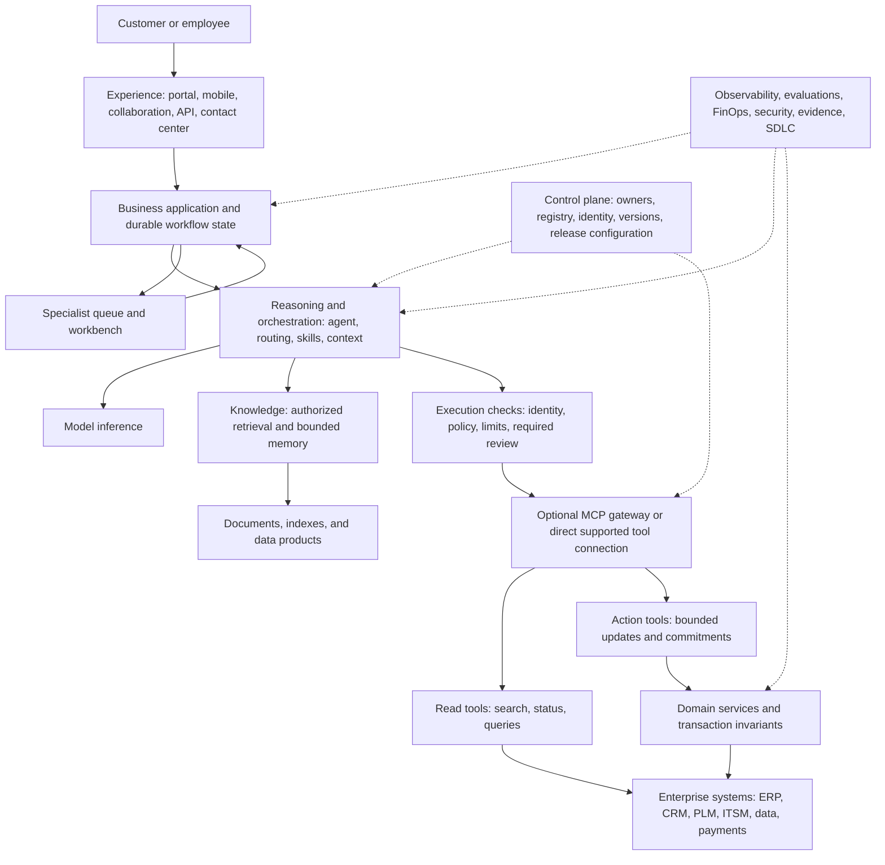
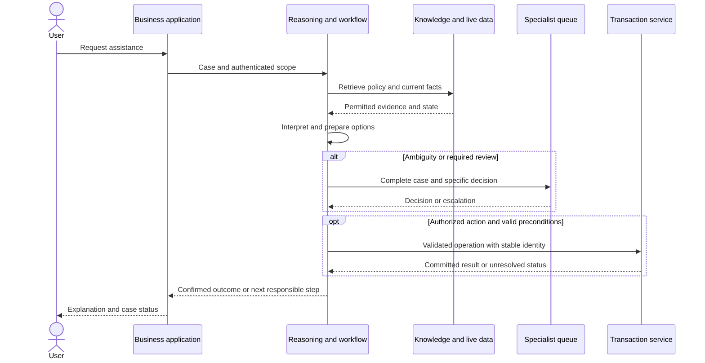

# End-to-end enterprise architecture for LLM and agent services

The architecture starts with a business process and ends with a supported service and verified outcome. The model, retrieval system, agent runtime, and tool protocol are components within it. This is a proposed logical design; the [Google Cloud chapter](gcp-enterprise-architecture.md) and [cloud comparison](cross-cloud-comparison.md) map it to actual platforms.

## Architecture layers

| Layer | Responsibility | Decisions |
|---|---|---|
| Business and process | Define the outcome and redesigned work | Eligible cases, owner, handoffs, benefit measures |
| Experience | Put the service in the user's workflow | Portal, mobile, collaboration, API, contact center, correction, accessibility |
| Application | Coordinate the process and durable state | Deterministic steps, adaptive reasoning, long-running work, review |
| AI | Interpret, synthesize, propose | Model selection, routing, prompts, skills, multimodality, tools |
| Data and knowledge | Supply relevant and authoritative context | Documents, live records, retrieval, structured queries, freshness, memory |
| Integration | Read and change business systems | APIs, MCP, events, object access, transaction invariants |
| Infrastructure | Run the workload | Runtime, identity, network, regions, quotas, capacity, resilience |
| Operations and economics | Sustain outcomes | Evaluation, telemetry, incidents, adoption, cost, improvement |

Security and governance run through these layers. They influence architecture choices while business and application design remain central.

## Production reference view

The control plane manages configuration and lifecycle; it is not necessarily a sequential network hop. The gateway is optional and cannot replace domain authorization. Read-only tools still require confidentiality and object-access controls.

Separate durable process state from conversation history. The application must know whether a case is waiting for information, awaiting review, committed, failed, or unresolved even if model context is lost.

## Four collaborating planes

| Plane | Contents | Business purpose |
|---|---|---|
| Reasoning | Model, agent loop, routing, procedures, orchestration | Interpret intent and choose useful next steps |
| Knowledge | Documents, records, retrieval, context, bounded memory | Supply relevant evidence and facts |
| Action | Tools, APIs, workflows, transaction services | Produce a real business result |
| Control | Identity, policy, registry, release, evaluation, evidence | Make operation accountable and maintainable |

MCP standardizes part of the connection between the host and knowledge/action capabilities. It does not supply the entire data platform, business process, or operating model. [MCP foundations](mcp-foundations.md) explains the version-specific boundary.

## Data architecture

The preparation path inventories sources, assigns ownership, preserves permissions, parses content, removes duplication, creates indexes or embeddings where useful, and evaluates retrieval. Updates and deletions need a freshness commitment.

The online path establishes the task and authenticated scope, retrieves relevant permitted evidence, reads live operational facts when required, and builds a minimal context. Distinguish source-backed facts, interpretation, and uncertainty in the output.

Use search for documents, governed queries for structured analysis, and domain APIs for transactional facts. Keep authoritative state in the system of record. Memory needs purpose, access, correction, retention, and ownership; it is not an unlimited store of user interactions.

## Application and reasoning architecture

Use deterministic workflow for known steps and rules. Introduce adaptive reasoning where intent or evidence changes the next useful step. Define completion criteria, call and time budgets, clarification, cancellation, and escalation.

Introduce multiple agents only for independently meaningful work packages. Define shared state, message contracts, timeout, duplicates, and one owner of the final outcome. Extra agents can increase repeated context and coordination cost.

Long-running work needs durable jobs and explicit status. An HTTP request or runtime session should not be the sole record of a business commitment. Verify workflow durability separately from agent hosting and session features.

## Integration and transaction architecture

Tools need typed inputs, clear results, versioning, safe errors, and accountable support. Prefer existing domain APIs where they meet the need. Add MCP when common discovery, invocation, and host reuse create value.

A service-recovery operation progresses through **proposal, authorization, commit, and communication**. It must not report completion based only on a plausible proposal. Domain services validate current state, object ownership, aggregate limits, and required approvals at execution.

Rejection, expired approval, or unresolved authority must prevent execution. Approval is bound to the actual action and does not transfer to changed arguments. [ADR-001](../decisions/001-enforce-authority-at-execution.md) details the enforcement decision.

## Platform and deployment design

| Concern | Required design work |
|---|---|
| Environments | Separate development, evaluation, production; controlled promotion |
| Identity and tenancy | Workload/user identity, delegation, least privilege, object isolation |
| Networking and data | Approved destinations, locality, private connectivity where required, egress, retention |
| Capacity | Model quotas, concurrent sessions, tool limits, queue depth, downstream load |
| Availability | Dependency map, timeout budgets, supported regions, degraded mode |
| Delivery | Versioned artifacts/configuration, repeatable deployment, supported rollout, rollback |
| Observability | Correlation across user, model, retrieval, tools, queues, transaction |
| Economics | Attribution by process, environment, team, and workload |

Managed platforms reduce selected infrastructure responsibilities. The enterprise still owns process fit, data quality, application semantics, outcome acceptance, and operational response. Explicit resource-oriented access is consistent with [NIST zero trust architecture](https://csrc.nist.gov/pubs/sp/800/207/final).

## Failure behavior and evaluation

| Failure | Designed response |
|---|---|
| Missing or contradictory evidence | Clarify or escalate with known facts |
| Model or retrieval outage | Honest degraded path or staffed fallback |
| Read failure | Preserve the case and communicate the next step |
| Timeout after possible commit | Reconcile durable status before retrying |
| Duplicate/concurrent action | Enforce idempotency and aggregate constraints atomically |
| Overloaded human queue | Expose aging; limit new proposals or change routing |
| Regressed dependency version | Pause expansion, roll back, re-evaluate |

Evaluate interpretation, retrieval, faithful responses, tools, transactions, handoffs, latency, cost, and final business outcomes. Use representative and failure cases. Record application, model/configuration, procedure, tool, data/index, policy, evaluation, and deployment versions.

Collect relevant evidence with minimization. Raw hidden reasoning is not required to record explicit decisions, sources, outcomes, and limitations.

## Architecture deliverables

Produce a process-to-capability map, logical and deployment views, data flows, integration contracts, capacity and cost model, test strategy, operating responsibilities, failure playbooks, and decision records. Separate proposed design, implementation, and demonstrated evidence.

Continue to the [GCP implementation](gcp-enterprise-architecture.md), [cloud comparison](cross-cloud-comparison.md), and [platform decision framework](platform-decision-framework.md).
