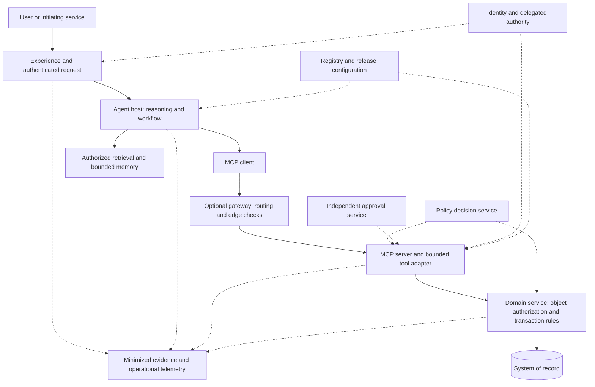

# Reference architecture: authority from intent to committed outcome

This is a **proposed provider-neutral design**, not a prescribed MCP deployment topology. The protocol boundary and the business authority boundary are related but distinct. The [MCP foundations](mcp-foundations.md) chapter describes the versioned protocol requirements.

## Logical view



Solid arrows show the principal request and data paths. Dotted arrows show supporting control and evidence relationships. Components are logical responsibilities; multiple responsibilities may share a deployment if isolation and accountability remain clear.

A gateway is optional. It can centralize common routing, identity checks, rate limits, and metadata controls. It cannot replace record-level authorization and transaction rules in the domain service. Direct-to-server paths must be denied or meet equivalent enforcement requirements. See [ADR-001](../decisions/001-enforce-authority-at-execution.md).

## Trust boundaries and ownership

| Boundary | Treat as untrusted | Enforce before crossing | Responsible owner |
|---|---|---|---|
| Request to agent host | User text, attachments, claimed identity in a message | Authenticate through a trusted channel; establish purpose and permitted scope | Experience and identity owners |
| Retrieved content to reasoning | Documents, resource contents, tool results, embedded instructions | Access filters, data minimization, source attribution, context separation | Data and application owners |
| Proposal to tool service | Model-selected operation and arguments | Validate schema, principal, delegation, target object, current policy, and approval | Tool and control owners |
| Tool service to business transaction | Caller-supplied state and eligibility assumptions | Fresh state, domain invariants, cumulative limits, concurrency, idempotency | Domain service owner |
| Execution to evidence store | Raw content and asserted success | Correlate verified outcome; redact, protect, and retain only justified evidence | Operations and evidence owners |

Network location alone should not establish trust. This recommendation aligns with NIST's zero trust guidance, which centers access decisions on resources and explicit authentication and authorization rather than implicit trust in a network location. [NIST SP 800-207](https://csrc.nist.gov/pubs/sp/800/207/final)

## A material action, end to end

```mermaid
sequenceDiagram
    actor User
    participant Host as Agent host
    participant Tool as Tool service
    participant Policy as Policy decision
    participant Approval as Approval service
    participant Domain as Domain service
    participant Record as System of record
    User->>Host: Request under authenticated scope
    Host->>Tool: Propose action with expected state and idempotency key
    Tool->>Policy: Evaluate verified identity, scope, arguments, policy
    alt Denied
        Policy-->>Tool: Deny with bounded reason
        Tool-->>Host: No action performed
    else Approval required
        Policy-->>Tool: Approval requirement
        Tool->>Approval: Request approval bound to exact transaction
        Approval-->>Tool: Verified approval reference or rejection
        Note over Tool,Domain: Continue only with valid approval; recheck authority and state
    else Allowed within delegated limits
        Policy-->>Tool: Permit with obligations
    end
    opt Authorized action with all obligations satisfied
        Tool->>Domain: Validated request and authority evidence
        Domain->>Record: Atomically enforce invariants and commit or replay
        Record-->>Domain: Durable outcome or unresolved status
        Domain-->>Tool: Transaction reference and verified status
        Tool-->>Host: Minimized result
        Host-->>User: Explain confirmed outcome or pending reconciliation
    end
```

The approval branch is conditional; it must not be interpreted as permission to continue after rejection, expiry, cancellation, or changed arguments. The final execution block requires a fresh valid authorization decision in every path.

The approval artifact binds the principal, delegated scope, tenant, object, operation, canonical arguments, policy version, expiry, and relevant state context. A changed amount or destination invalidates the prior decision. Approval consumption and transaction execution require a defined recovery design across their respective systems; independent writes do not become atomic because they share a trace identifier.

## Contracts worth standardizing

| Contract | Minimum content | Why it matters |
|---|---|---|
| Capability registration | Owner, purpose, schema version, data scope, risk, support, review date | Establishes accountability and consumption conditions |
| Invocation | Operation, typed arguments, correlation, idempotency, expected state | Enables validation and safe retry design |
| Authorization context | Authenticated subject, workload, delegation, resource scope, policy decision | Prevents model text from supplying its own authority |
| Result | Status, safe reason code, transaction reference, state version, retry guidance | Distinguishes completion, rejection, and uncertainty |
| Release record | Model/host/tool/workflow/policy/evaluation identifiers, approvals, rollback plan | Makes change review and incident reconstruction possible |

These are enterprise contract recommendations, not mandatory MCP fields. Domain correlation and idempotency semantics must be implemented explicitly; JSON-RPC IDs do not supply business transaction guarantees.

## Failure behavior is part of the architecture

| Failure | Required design decision |
|---|---|
| Policy or approval service unavailable | Default to no new material action; use a documented exception procedure outside the agent |
| Timeout after possible commit | Query durable transaction state using the same operation identity; do not blindly retry with a new key |
| Duplicate or concurrent proposal | Enforce atomic idempotency and aggregate limits at the transaction boundary |
| Stale authoritative snapshot | Reject or re-read and re-evaluate; obtain renewed approval if its binding no longer holds |
| Tool or metadata version changed | Halt incompatible use until compatibility, risk, and evaluation review completes |
| Evidence service degraded | Declare whether action is blocked or safely buffered; demonstrate integrity and recovery for the chosen risk tier |
| Compromised tool or credential | Revoke access, stop new actions, isolate the service, and reconcile in-flight transactions |

Read-only requests may have different availability policies, but confidentiality and object authorization still apply. A fallback must never silently expand access or action limits.

## Data and memory boundaries

Perform record filtering before content reaches the model. Limit tool results to fields needed for the task. Retain authoritative facts in systems of record; mark cached context with origin and freshness. Treat durable agent memory as a governed data store with ownership, access control, deletion, and retention rules.

Propagate minimal identity and audit context. Avoid collecting entire prompts, chain-of-thought, or raw personal records as a default observability strategy. Prefer explicit decision inputs, policy outcomes, safe summaries, and transaction references. Separate operational telemetry from access-restricted evidence.

## Deployment choices

A local MCP process is appropriate for isolated development when its environment, filesystem, and credentials are constrained. Production often benefits from a centrally operated service, but remote execution is not intrinsically safer. Evaluate both against identity, tenancy, isolation, network egress, upgrade control, availability, and recovery requirements.

Use the [platform framework](platform-decision-framework.md) to test alternatives. Pin the deployed protocol revision, SDKs, transports, and extensions. An example that works against an older session-based MCP implementation is not automatically compatible with this guide's 2026-07-28 baseline.

## Evidence required before production

Produce an invocation-to-transaction trace, object-authorization denial tests, prompt-injection cases, expired and substituted approval tests, concurrent-limit tests, duplicate-retry tests, timeout reconciliation, tool revocation, and rollback or compensation exercises. Also test whether human operators can understand and resolve exceptions within their service commitments.

The [security chapter](security-and-assurance.md) defines the threat-oriented evidence; the [release template](../templates/release-review.md) turns it into a reviewable decision record.
